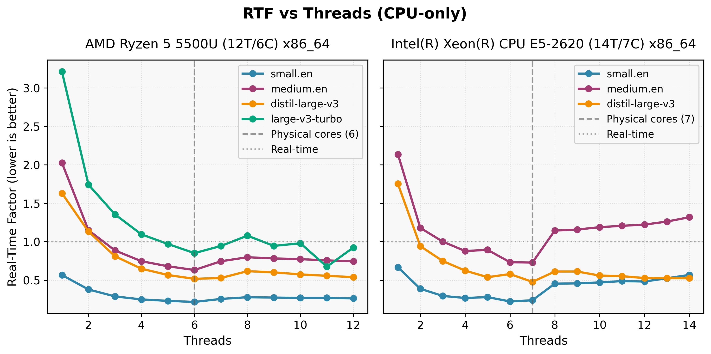
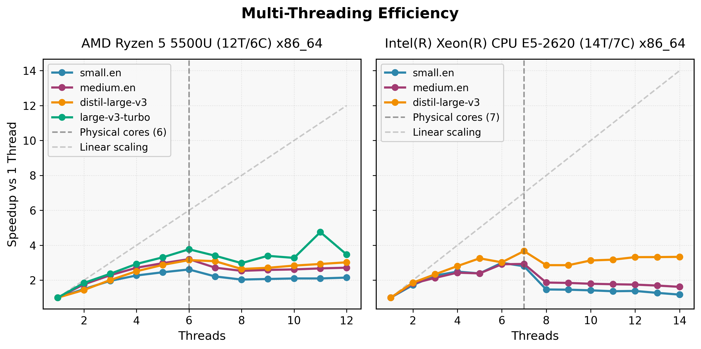
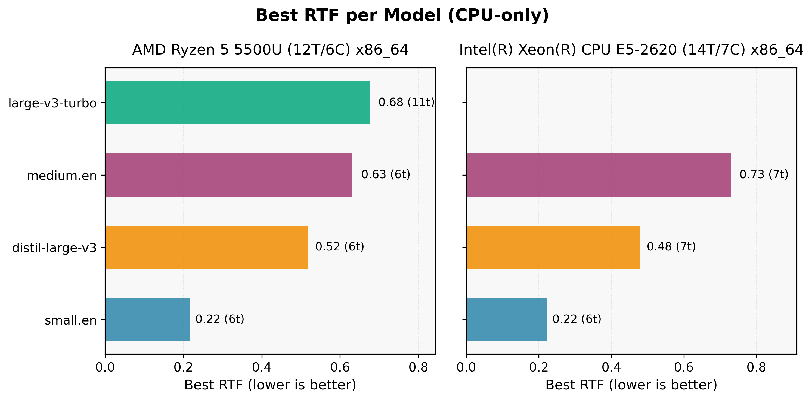

# CPU transcription benchmarks (faster-whisper)

This is the summary of CPU benchmark findings to inform transcription model selection for this project.

Benchmarks focus on **real-time feasibility, thread scaling behavior and resource efficiency**, rather than peak accuracy.

## Benchmarks
  
  
  
 
## Methodology

- Backend: faster-whisper (CPU only)
- Audio: ~151s WAV, 16 kHz
- Speaker: non-native clinician
- Each benchmark run:
  1. Fresh model load
  2. Warm-up (primer) run
  3. Measured inference run
- Thread count explicitly controlled per run

### Benchmarking Artefacts
- [Raw benchmark data](data/faster_whisper_cpu_benchmarks.csv)
- [Benchmark runner](run_benchmark.py)

### Tested on Systems

- **Laptop-class CPU**: 6 physical cores / 12 logical
- **Server-class CPU**: 14 physical cores (VM, single NUMA node)

Results should be interpreted comparatively, not as absolute performance claims.

## Key Insights

### 1. Physical cores define the scaling ceiling

For all models:
- RTF improves up to ~physical core count
- Performance degrades noticeably beyond that point
- Oversubscription increases latency and variance

This effect is strongest for larger models.

---

### 2. `small.en` is the most practical CPU model

- Achieved best RTF on both systems (≈0.22)
- Predictable scaling behavior
- Minimal sensitivity to moderate thread misconfiguration

This makes it the most reliable choice for **interactive dictation**.

---

### 3. `distil-large-v3` excels on server CPUs

On the server-class system:
- Outperformed `medium.en` at comparable thread counts
- Maintained stable RTF across a wider thread range
- Represents the best accuracy/latency compromise for batch or server-side transcription

---

### 4. Larger models amplify misconfiguration costs

- `medium.en` and `large-v3-turbo` showed deteriorating performance when over-scaled
- Model load time becomes non-trivial

---

>## Notes on `large-v3-turbo` whisper model
>`large-v3-turbo` was tested on the laptop system using a dedicated installation approach. Model availability may differ across environments.
>
>Results are included for caustious interpretation.

